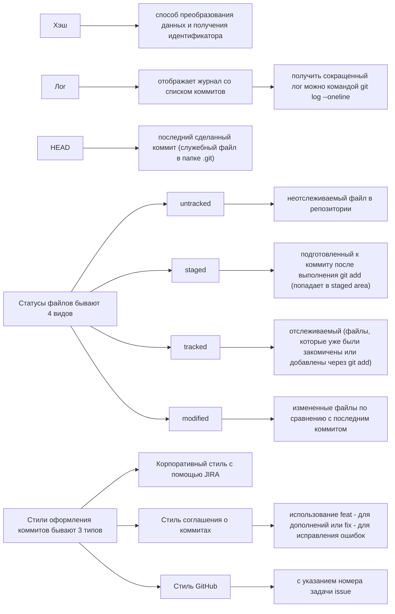

# Список изученных команд. 

1. Сменить директорию - cd. 
2. Домашняя директория - ~. 
3. Родительская директория - /. 
4. Показать список файлов - ls. 
5. Показать скрытые файлы - ls -a (скрытые файлы находятся во флаге -a). 
6. Показать место где я нахожусь сейчас - pwd. 
7. Сделать коммит - git commit -m. 
8. Запушить изменения на GitHub - git push. 
9. Сделать файлы отлеживаемыми - git add.
10. Посмотреть статус репозитория - git status. 
11. Инициализировать репозитория - git init. 

## Практическая работа 2. Информация о хэше, логе, HEAD, статусе файлов и оформлений сообщений к коммитам.  

